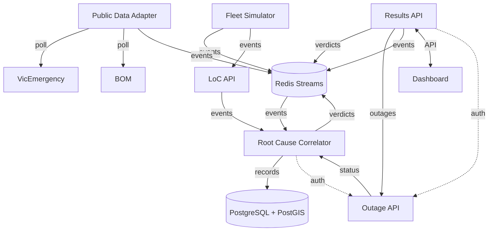

# Project Architecture

## Tech Stack Summary

Monorepo with 6 backend microservices, a React frontend,
and Redis Streams as the internal message bus.

| Layer     | Technologies                                                             |
| --------- | ------------------------------------------------------------------------ |
| Language  | TypeScript (Node.js 24 LTS)                                              |
| Structure | pnpm monorepo, shared types package (`@nic/shared`)                      |
| Frontend  | React 19, Vite 8, TanStack Query, TailwindCSS 4, shadcn/ui, MapLibre GL  |
| Backend   | Express 5 (6 services)                                                   |
| Databases | PostgreSQL 15 + PostGIS, Redis 7 (Streams)                               |
| Transport | REST, WebSocket, Redis Streams (eventbus)                                |
| Infra     | Docker (node:24-alpine images), docker-compose, GitHub Actions CI        |
| Auth      | JWT (HS256)                                                              |
| Testing   | Vitest, Testing Library (web), supertest (services), msw (web API mocks) |

The web app fetches and caches API data with
[TanStack Query](https://tanstack.com/query) (`QueryClientProvider` is set up in
`web/src/App.tsx`)

In production containers the dashboard is served as static files by nginx
(see `web/Dockerfile`, `web/nginx.conf`). Locally `pnpm dev` runs the Vite dev
server on port 3000 instead.

### Services & Ports

| Service             | Package                    | Port | Role                                           |
| ------------------- | -------------------------- | ---- | ---------------------------------------------- |
| mock-outage-api     | `@nic/mock-outage-api`     | 3001 | Mocked Telstra-style outage status API         |
| fleet-simulator     | `@nic/fleet-simulator`     | 3002 | Simulates device fleet, publishes events       |
| public-data-adapter | `@nic/public-data-adapter` | 3003 | Mocks VicEmergency/BOM feeds, publishes events |
| correlator          | `@nic/correlator`          | 3004 | Root cause correlation worker                  |
| results-api         | `@nic/results-api`         | 3005 | Verdict store, REST API and WebSocket feed     |
| mock-loc-api        | `@nic/mock-loc-api`        | 3006 | Mocked Loss of Connectivity subscription API   |

Infrastructure: PostgreSQL `5432`, Redis `6379`, web `3000`.

All HTTP services expose `GET /<service-name>/v0/health-check` (or `GET /health-check`
for mock-loc-api). Health checks return `{ statusCode: 200, service }` when
dependencies (Redis, PostgreSQL) are reachable, or `{ statusCode: 503, service }`
when they are not. The correlator also checks PostgreSQL connectivity.

## Architecture Diagram

