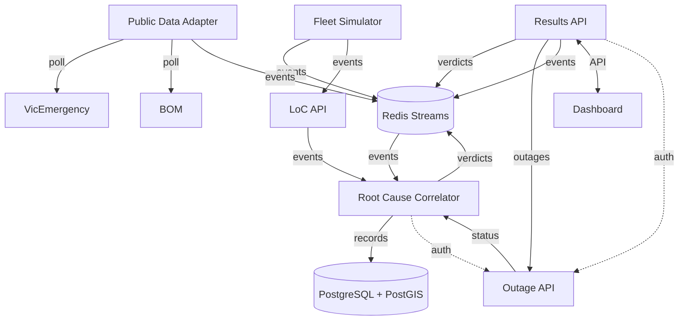

# Tech Stack Summary

Monorepo with 6 backend microservices, a React frontend,
and Redis Streams as the internal message bus.

| Layer     | Technologies                                            |
| --------- | ------------------------------------------------------- |
| Language  | TypeScript (Node.js 25)                                 |
| Structure | pnpm monorepo                                           |
| Frontend  | React 18, Vite 5, TailwindCSS 4, shadcn/ui, MapLibre GL |
| Backend   | Express 4 (6 services)                                  |
| Databases | PostgreSQL 15 + PostGIS, Redis 7 (Streams)              |
| Transport | REST, WebSocket, Redis Streams (eventbus)               |
| Infra     | Docker, docker-compose, GitHub Actions CI               |
| Auth      | JWT (HS256)                                             |
| Testing   | Vitest                                                  |

# Architecture Diagram

